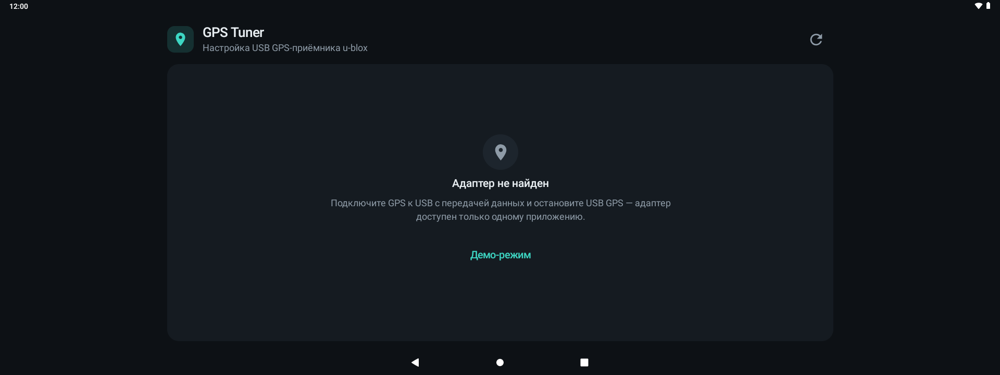
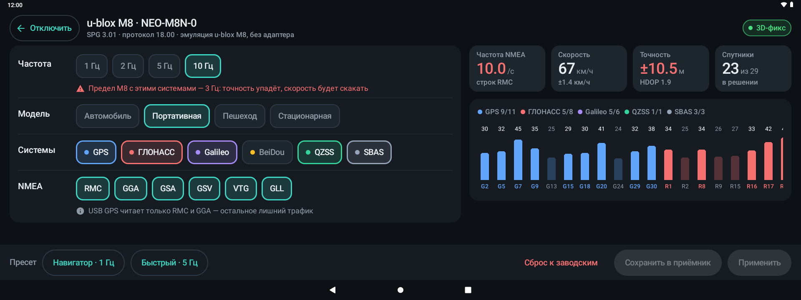
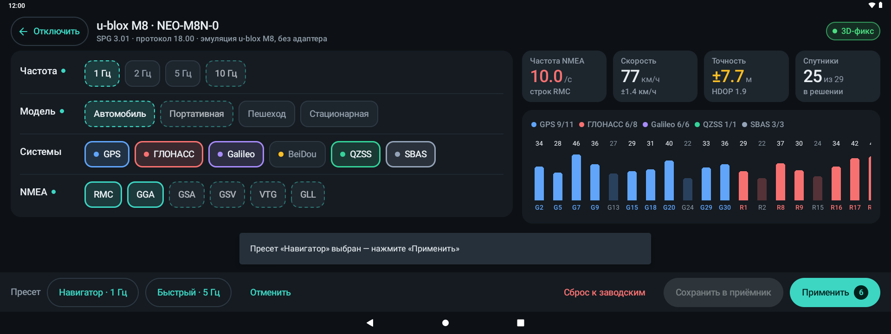
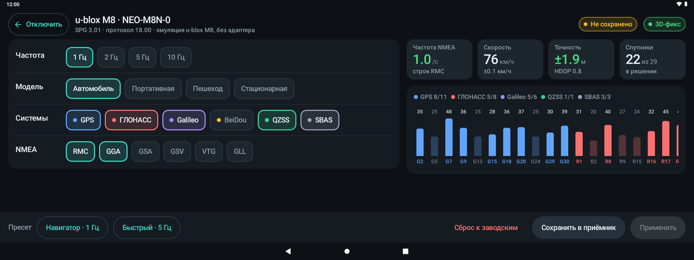
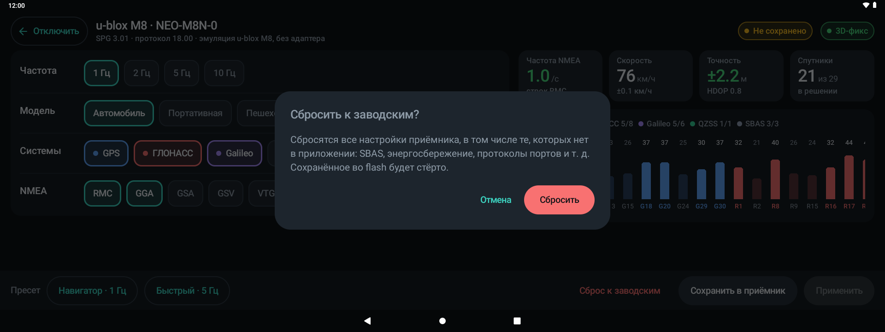
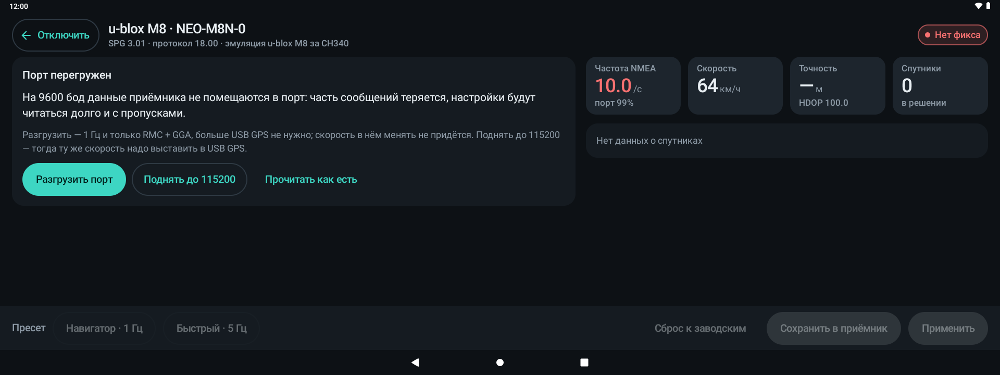
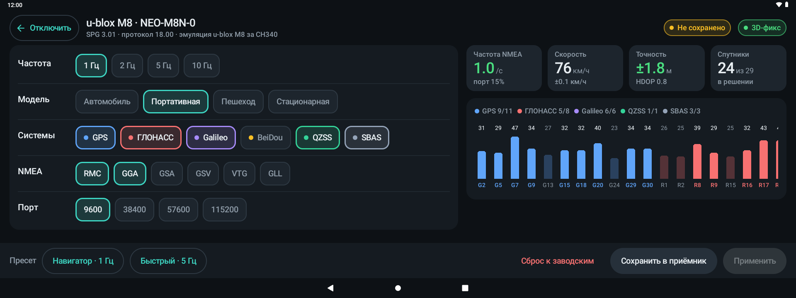

# GPS Tuner

Android-приложение для настройки USB GPS-приёмника u-blox прямо на головном устройстве (ГУ) автомобиля — без root и без u-center.

Главный сценарий — вернуть 1 Гц после неудачной настройки на 10 Гц, не добираясь до адаптера: оставить только те сообщения NMEA, которые читает USB GPS, и сохранить настройки в память приёмника.

**[Скачать APK](https://github.com/Vorobeyyyyyy/gps-tuner/releases/latest)**

## ✨ Возможности

- **Сведения о приёмнике:** чип, прошивка, версия протокола.
- **Живой статус:** тип фикса, спутники, точность, скорость, реальная частота NMEA, уровни сигнала по системам. У адаптеров с мостом — загрузка порта.
- **Настройки:** частота (1–10 Гц), модель движения, системы (GPS, ГЛОНАСС, Galileo, BeiDou, QZSS, SBAS), сообщения NMEA, скорость порта у мостов.
- **Пресеты** «Навигатор · 1 Гц» и «Быстрый · 5 Гц»: модель «Автомобиль» и только RMC + GGA — ровно то, что читает USB GPS.
- **Применить, сохранить, сбросить:** изменения сначала уходят в оперативную память приёмника, во flash — отдельной кнопкой. Сброс к заводским — с подтверждением.
- **Защита от ошибок:** пределы частоты M8 для включённых систем, ГЛОНАСС и BeiDou не включаются вместе. Предупреждения о перегрузке порта и выключенных RMC/GGA.
- **Адаптеры с мостом** CH340, CP210x, PL2303, FTDI: автоподбор скорости, разгрузка перегруженного порта одной кнопкой.
- **Демо-режим:** эмулятор приёмника, чтобы посмотреть интерфейс без адаптера.

<details>
<summary><b>📸 Скриншоты</b></summary>

**Подключение.** Адаптер не найден — можно открыть демо-режим.



**Приёмник.** 10 Гц с тремя системами — выше предела M8, приложение предупреждает.



**Выбран пресет «Навигатор».** Пунктиром отмечено, что изменится, на «Применить» — число изменений.



**После «Применить».** 1 Гц, только RMC и GGA. «Не сохранено» — изменения пока только в оперативной памяти приёмника.



**Сброс к заводским** — только с подтверждением.



**Адаптер с мостом на 9600 бод.** Порт загружен на 99% — приложение предлагает его разгрузить.



**После «Разгрузить порт».** 1 Гц, RMC + GGA, загрузка 15% на тех же 9600 бод — скорость в USB GPS менять не нужно.



</details>

## 📱 Совместимость

| | |
|---|---|
| Android | 9 и новее, альбомный экран. Сделано для ГУ Belgee S50 / Emgrand SS11 |
| Приёмник | u-blox M8. u-blox 6/7 — частично, M9/M10 не поддерживаются |
| Подключение | Родной USB u-blox (CDC-ACM) или мосты CH340, CP210x, PL2303, FTDI |
| Права | Только доступ к USB-устройству, root не нужен |

## 📲 Установка

Скачайте `GpsTuner-<версия>.apk` из [последнего релиза](https://github.com/Vorobeyyyyyy/gps-tuner/releases/latest):
```
adb connect <IP ГУ>:5555
adb install -r GpsTuner-<версия>.apk
```

## ▶️ Как пользоваться

1. Остановите **USB GPS** (в самом приложении или ползунком в FreeTUGA Кнопках).
2. GPS Tuner → «Подключить» → разрешите доступ к USB.
   - Если появилось «Адаптер занят» — USB GPS ещё работает.
   - Адаптер с мостом на перегруженном порту → карточка «Порт перегружен» → «Разгрузить порт».
3. Пресет → «Применить».
   - **«Навигатор · 1 Гц»** — больше спутников (с Galileo).
   - **«Быстрый · 5 Гц»** — GPS + ГЛОНАСС, быстрее реакция на развязках.
   - Справа частота NMEA должна стать 1,0/с или 5,0/с и гореть зелёным.
   - NMEA остаются только RMC и GGA — больше USB GPS ничего не читает.
4. «Сохранить в приёмник».
5. «Отключить» → «Открыть USB GPS» и снова запустите его.
   - Если скорость порта менялась — выставьте её же в настройках USB GPS.

**Демо-режим** (без адаптера) — кнопка на первом экране. Эмулятор стартует «как у вас сейчас»: 10 Гц, сохранено во flash.

Демо адаптера с мостом на 9600 бод (только через adb): `--ez demo_bridge true`.

## 🛠 Сборка

Нужны JDK 17 и Android SDK 34.
```
./gradlew testDebugUnitTest    # автотесты
./gradlew assembleRelease      # app/build/outputs/apk/release/app-release.apk
```

### Релизы
Каждый push в `main` запускает GitHub Actions (`.github/workflows/release.yml`): тесты → APK → релиз `v1.0.N`, где N — число коммитов в `main`. Первые две цифры — `appVersion` в `gradle.properties`.

Релизы подписываются release-ключом из секретов репозитория. Локальный `assembleRelease` подписывает debug-ключом, такой APK не встанет поверх версии из Releases. Подписать локально release-ключом:
```
set -a; . ~/.android/gps-tuner-release.env; set +a
./gradlew assembleRelease -PversionCode=<N>
```

Требования и обоснования решений — [ТРЕБОВАНИЯ.md](ТРЕБОВАНИЯ.md), устройство кода и инварианты — [AGENTS.md](AGENTS.md).

## 📄 Лицензия

[MIT](LICENSE)
